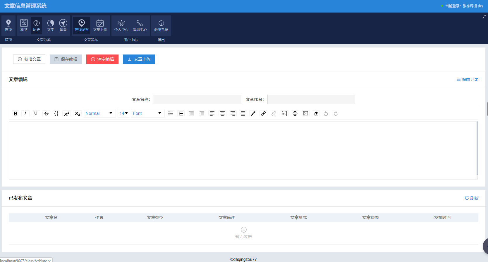

# 介绍
本系统为支持多关键词搜索的文章信息管理系统，系统用户主要分为管理员、作者以及普通用户。系统的主要功能模块分为：首页、文章分类、文章发布、文章管理、用户中心和消息中心。

**注意：本系统是针对于WEB的JS全栈开发，纯练手项目，如果您有兴趣，可以点下“star”支持一下哦😄😄**


## 技术栈

nodejs+express+mongodb+socketio+es6+react+antd+webpack

## 安装与运行

**系统正常运行，需要完成以下条件**
* node (6.0 及以上版本)
* mongodb (开启状态)

**安装项目**
```
git clone https://github.com/daqingzou77/aricleCms.git
```
**分别在项目中web与backend目录下，执行启动命令**
```
npm install 或 yarn(推荐)

npm start 或 yarn start 
```
**打包项目**
```
yarn build
```

## 效果演示
> **主页**

> **文章分类**

> **文章发布**

> **用户中心**

> **消息中心**


## 项目架构
```
.
├─ imgSrc/                                     # 系统截图
├─ readMe.md/                                  # 帮助文档
├─ backend/                                    # 后端代码目录
│   ├─ bin/                                    # 启动脚本文件目录
|   ├─ config/                                 # 后台配置目录
│   ├─ controller/                             # 控制层目录
|   |   |     |── annex.js                     # 附件处理
|   |   |     |── article.js                   # 文章管理
|   |   |     |── classify.js                  # 文章分类
|   |   |     |── home.js                      # 主页
|   |   |     |── messageCenter.js             # 消息中心
|   |   |     |── publish.js                   # 文章发布
|   |   |     |── socket.js                    # 在线聊天
|   |   |     |── user.js                      # 用户管理
│   ├─ db/                                     # 数据库目录
│   ├─ initData/                               # 模拟数据目录
│   ├─ logs/                                   # 日志存储目录
│   ├─ middlewares/                            # 中间层
│   ├─ model/                                  # 数据库model
|   |   |     |── article.js                   # 文章
|   |   |     |── chat.js                      # 聊天记录
|   |   |     |── edit.js                      # 编辑保存
|   |   |     |── offline.js                   # 离线消息
|   |   |     |── user.js                      # 用户
│   ├─ public/                                 # 静态资源目录
│   ├─ routs/                                  # 请求路由目录
│   ├─ test/                                   # 算法测试
│   ├─ upload/                                 # 文件上传存储目录
│   ├─ utils/                                  # 工具库目录
|   |   |     |── encrypt.js                   # 加密类
|   |   |     |── logger.js                    # 日志配置文件
|   |   |     |── randomPrime.js               # 模拟随机的大素数（加解密）
|   |   |     |── tools.js                     # 工具类
│   ├─ app.js                                  # 后台服务启动文件
├─ web/                                        # 前端文件目录
│   ├─ config/                                 # 存储webpack配置文件
│   ├─ src/                                    # 存放启动项目的脚本文件
│   │   ├─ assets/                             # 资源存储目录
│   │   ├─ components/                         # 常用组件
|   |   |     |── ContentModal/                # 弹窗内容编辑框
|   |   |     |── CustomizeEmpty/              # 自定义空组件
|   |   |     |── DataBlock/                   # 显示数据块
|   |   |     |── Exception/                   # 异常组件
|   |   |     |── FormElement/                 # FormElement
|   |   |     |── FormRow/                     # FormRow 
|   |   |     |── Login/                       # 登录组件
|   |   |     |── Modal/                       # 自定义弹窗组件
|   |   |     |── PageLoading/                 # 刷新
|   |   |     |── QueryBar/                    # 折叠面板
|   |   |     |── Result/                      # 结果显示
|   |   |     |── StandardFormRow/             # 标准FormRow
|   |   |     |── SystemFooter/                # 系统底部 
|   |   |     |── SystemHeader/                # 系统头部
|   |   |     |── SystemMenu/                  # 系统菜单栏
│   │   ├─ e2e/                                # 集成测试用例
│   │   ├─ layout/                             # 布局目录
|   |   |     |── UserLayout.js                # 登录与注册的页面布局
|   |   |     |── ScheduleLayout.js            # 主页面布局
│   │   ├─ locales/                            # 国际化目录
│   │   ├─ models/                             # dva model目录
│   │   ├─ pages/                              # 核心页面目录
|   |   |     |── Classify/                    # 文章分类
|   |   |     |── Home/                        # 主页面
|   |   |     |── Login/                       # 登录注册
|   |   |     |── Maintain/                    # 文章管理
|   |   |     |── MessageCenter/               # 消息中心
|   |   |     |── Publish/                     # 文章发布 
|   |   |     |── UserCenter/                  # 用户中心
│   │   ├─ services/                           # 请求接口目录
|   |   |     |── annexService.js              # 附件管理
|   |   |     |── articleService.js            # 文章管理
|   |   |     |── auditService.js              # 文章审核
|   |   |     |── classifyService.js           # 文章分类
|   |   |     |── homeService.js               # 主页信息
|   |   |     |── loginRegisterService.js      # 登录注册
|   |   |     |── messageService.js            # 消息中心
|   |   |     |── publishService.js            # 文章发布
|   |   |     |── userService.js               # 用户管理
│   │   ├─ utils/                              # 工具库目录
│   │   ├─ global.js                           # 全局文件
│   │   ├─ global.less                         # 全局样式
│   ├─ test/                                   # 测试工具
```

**1.封装可鼠标拖拽的的弹窗组件**
```
class Modal extends React.PureCompnent {
   constructor(props) {
    super(props);
    const { top } = this.props;
    let margin = 'auto';
    if (top !== 0) {
      margin = '0 auto';
    }
    this.state = {
      pageX: 0,
      pageY: top,
      right: 0,
      bottom: 0,
      moving: false,
      modalId: randomWord(true, 3, 32),
      headerId: randomWord(true, 3, 32),
      diffX: 0,
      diffY: 0,
      margin,
    };
  }
  
  ...
  
  render() {
    const { visible,children } = this.props;
    if (visible&&children!==undefined&&children!==null) {
      return ReactDOM.createPortal(this.getLayout(), this.getContainer());
    }
    if (this.modal) {
      if (this.modal.parentNode) {
        this.modal.parentNode.removeChild(this.modal);
      }
    }
    return null;
  }
}
export default Modal;
```
效果如下


**2.查询算法-依据查询关键词匹配度返回接过**
```
class Encrypt {
  constructor(keywords) {
    this.save1 = 224;
    this.save2 = 512;
    this.save3 = 128;
    this.save4 = 128;
    this.n = keywords.length;
    this.K = K;
    this.K1 = K1;
    this.P = P;
    this.M = M;
    this.keywordsDictionary = keywords;
  }
    // 上传密文索引向量
  uploadCiphertextIndex(fileVectorArray, articlename, author) {
    const fileArray = this.fileIndexVector(fileVectorArray);
    const θ = this.getHashθ(articlename, author);
    const Ai = this.randomArrayAi();
    const I1 = this.ciphertextIndexVector(fileArray, θ, Ai);
    return { I1, θ}
  }

  // 根据查询词组生成密文搜索陷门
  getCiphertextDoor(queryVectorArray) {
    const queryArray = this.queryIndexVector(queryVectorArray);
    const Ci = this.randomArrayCi();
    const Q1 = this.cipherTextDoor(queryArray, this.M, Ci);
    return Q1;
  }
  ...
  // 最终相似度
  getFinalSmi(G, E) {
    return G.divide(E);
  }
}
```
